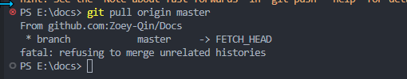
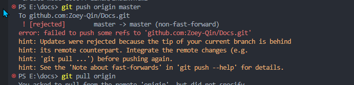

# 1. 现象

pull 远程仓库时报错：fatal: refusing to merge unrelated histories，导致 push 时失败






# 2. 解决

这通常发生在尝试合并两个不相关的仓库历史时：


1. 使用 `--allow-unrelated-histories`选项来允许合并不相关的历史。

   ```sh
   git pull origin master --allow-unrelated-histories
   ```

   请注意，这个选项可能会导致合并后的历史变得混乱，所以在使用这个选项之前，请确保清楚了解可能产生的影响。
2. 或者，也可以考虑放弃合并，而是使用 `fetch`命令来获取远程分支的最新更改，并手动合并更改。

   ```sh
   git fetch origin master  # 获取远程分支的最新更改
   git merge origin/master   # 手动合并更改
   ```
