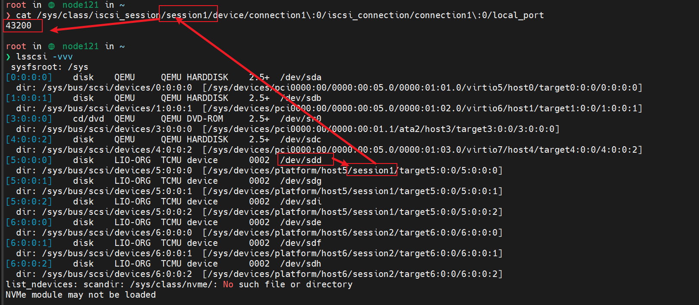

# 1. Multipath 简介

Device Mapper Multipath 可以将服务器节点和存储阵列之间的多条 IO 链路配置为一个单独的设备；

这些 IO 链路是由不同的线缆、交换机、控制器组成的 SAN 物理链路，multipath 将这些链路聚合在一起，生成一个单独的新设备

作用：

1. 数据冗余：multipath 可以实现在 active/passive 模式下的灾难转移，在 ap 模式下，只有一半的链路在工作，如果链路上的某一部分出现故障，multipath 就会切换到另一半链路上
2. 提高性能：multipath 亦可以配置为 active/active 模式，从而使 IO 任务以 round-robin 的方式分布到所有的链路上去；通过配置，multipath 还可以检测链路上的负载情况，动态地进行负载均衡

# 2. multipath 使用

## 2.1 multipath 部署

## 2.2 multipath 配置解释

这些配置项定义了对多路径设备的处理规则、默认配置以及黑名单例外规则，这些配置可以确保系统能够正确地识别和处理多路径设备。

```Bash
devices {
                device {
                        vendor                 "LIO-ORG"
                        product                "TCMU device"
                        hardware_handler       "1 alua"
                        path_grouping_policy   "failover"
                        path_selector          "queue-length 0"
                        failback               60
                        path_checker           tur
                        prio                   alua
                        prio_args          exclusive_pref_bit
                        fast_io_fail_tmo       25
                        no_path_retry          queue
                }
        }

blacklist {
# devnode ".*"
}

defaults {
        user_friendly_names yes
        find_multipaths yes
        enable_foreign "^$"
}

blacklist_exceptions {
        property "(SCSI_IDENT_|ID_WWN)"
}
```

1. `devices` 部分：这部分定义了对特定设备的处理规则。在这里，配置了对 LIO-ORG 供应商的 "TCMU device" 的处理规则。具体的配置包括：
   1. `vendor` 和 `product`：指定了需要处理的设备的厂商和产品信息。
   2. `hardware_handler`：指定了设备的硬件处理器，这里使用了 ALUA（Asymmetric Logical Unit Access）处理器。

      * ALUA 路径管理模式中的 "1" 表示使用了 ALUA 的标准版本。 ALUA 还有其他版本，比如 "2" 表示使用了 ALUA-2 标准
   3. `path_grouping_policy`：指定了路径分组的策略，这里是 failover，表示在主路径失效时切换到备用路径。
   4. `path_selector`：指定了路径选择器的策略，这里使用了 queue-length 0，表示使用队列长度为 0 的算法进行路径选择。
   5. `failback`：指定了路径的故障恢复时间，这里是 60 秒。
      在生产环境中如果使用主动/被动的分组策略，最好将 failback 设为 immediate，这样在发生路径故障后会立即切换到其他正常路径，以保证正常的数据访问
      failback 一般有以下可选参数：

      * immediate：表示指定立即恢复到包含活跃路径的最高级别路径组群
      * manual：不需要立即恢复，只有在操作者干预的情况下发生恢复
      * followover：当路径组的第一个路径成为活跃路径时应执行自动恢复
      * 大于 0 的数字：指定对应时间的推迟出错切换，以秒为单位，例如本文配置中为 60s

* `path_checker`：指定了路径检测器的类型，这里使用了 TUR（Test Unit Ready）检测器。
* `prio` 和 `prio_args`：指定了路径的优先级和相关参数，这里是 alua 和 exclusive_pref_bit。
* `fast_io_fail_tmo`：指定了快速 IO 失败超时时间，这里是 25 秒。
* `no_path_retry`：指定了无路径时的重试策略，这里是 queue，表示将 IO 请求放入队列等待路径恢复。

2. `blacklist` 部分：这部分定义了需要屏蔽的设备。在这里，所有设备都是被注释掉的，表示没有设备被屏蔽。
3. `defaults` 部分：这部分定义了默认的多路径设备配置。具体的配置包括：
   1. `user_friendly_names`：指定了是否使用用户友好的设备名，这里是启用了用户友好的设备名。
   2. `find_multipaths`：指定了是否查找多路径设备，这里是启用了查找多路径设备。
   3. `enable_foreign`：指定了哪些设备应该被视为外部设备，这里是没有指定任何外部设备。
4. `blacklist_exceptions` 部分：这部分定义了例外的黑名单规则。在这里，使用了正则表达式来匹配例外的属性，这里匹配了以 "SCSI_IDENT_" 或 "ID_WWN" 开头的属性。

# 3. 多路径切主

## 3.1 确认设备对应的路径

```Bash
multipath -ll
```


以 mpathc 为例，对应有 sdg、sdd 两个设备，同时可以看到 sdg 状态为 active，说明此时 sdg 为 mpathc 的主路径

## 3.2 各路径对应的 tcp 连接：

```
cat /sys/class/iscsi_session/session1/device/connection1\:0/iscsi_connection/connection1\:0/local_port

```



## 3.3 切换主路径

1. 进入 multipath 交互模式

```Bash
multipathd -k
```

2. 查看多路径拓扑

```Bash
show topology
```

与前文的信息对应


3. 切主

以 mpathc 为例，设备下有多条路径，第一条 sdg 为 group 1，第二条 sdd 为 group 2， 如果想切换主路径到sdd，那么需要执行：

```Bash
switch map mpathc group 2
```


## 3.4 测试

切换之后显示一般会有延时，可以打 IO 来看


对 mpathc 进行顺序读：可以看到负载在 sdd 上


# 4. multipath 断开 iscsi 连接


# 5. 切换模式


# 问题记录

---

# End
