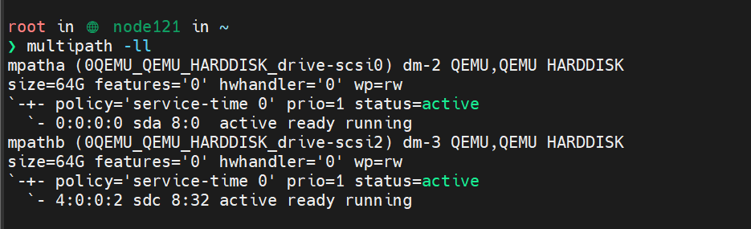
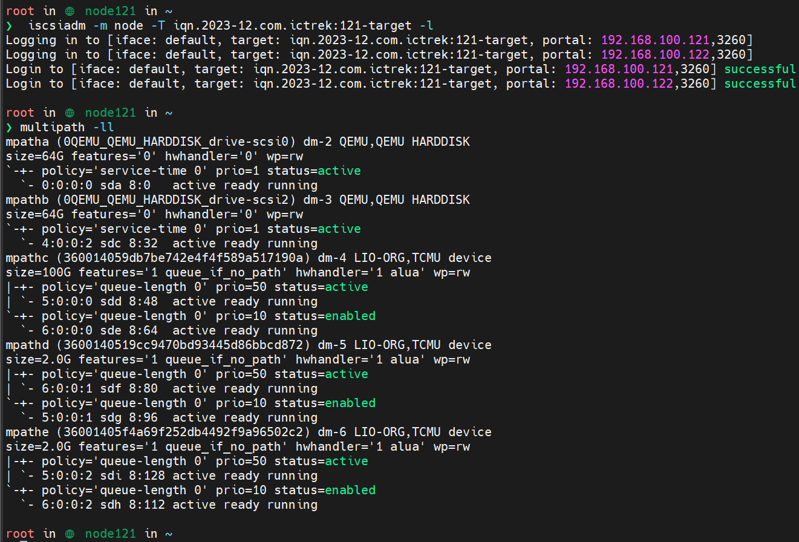

# 1. 链路失效：failed faulty running

现象：ALUA 模式下，mpath 的从链路都出现了失效的报错
（mpathc 的从链路也出现了相同现象，我这里手动使用 multipath -f mpathc 命令来临时移除了故障路径）


解决：

1. 有可能是 rbd-target-api 服务挂掉，需要拉起


# 2. 重启后重新扫描 iscsi

现象：

iscsi-target 和 iscsi-gw 所在节点重启后，看不到 iscsi 挂载的多路径 lun



解决：

重新连接到 iscsi-target

```bash
# iqn.xxx 为 target 名称
iscsiadm -m node -T iqn.2023-12.com.ictrek:121-target -l
```


