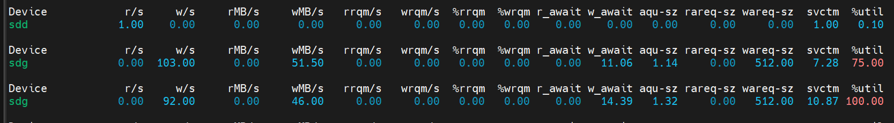

# 1. iostat 简介

# 2. iostat 参数

# 3. iostat 输出

eg：

以第一条输出结果为例作分析：

1. r/s：每秒钟的读取次数。在这个例子中，平均每秒有1次读取操作。
2. w/s：每秒钟的写入次数。在这个例子中，平均每秒没有写入操作。
3. rMB/s：每秒读取的数据量（MB）。在这个例子中，读取的数据量为0。
4. wMB/s：每秒写入的数据量（MB）。在这个例子中，写入的数据量为0。
5. rrqm/s：每秒发起的读取请求被合并的次数。在这个例子中，每秒没有发起读取请求被合并的次数。
6. wrqm/s：每秒发起的写入请求被合并的次数。在这个例子中，每秒没有发起写入请求被合并的次数。
7. %rrqm：合并的读取请求所占的百分比。在这个例子中，没有合并的读取请求。
8. %wrqm：合并的写入请求所占的百分比。在这个例子中，没有合并的写入请求。
9. r_await：读取操作的平均等待时间。在这个例子中，读取操作的平均等待时间为0。
10. w_await：写入操作的平均等待时间。在这个例子中，写入操作的平均等待时间为0。
11. aqu-sz：平均请求队列的长度。在这个例子中，请求队列长度为0。
12. rareq-sz：每次读取的平均大小（以扇区为单位）。在这个例子中，每次读取的平均大小为0。
13. wareq-sz：每次写入的平均大小（以扇区为单位）。在这个例子中，每次写入的平均大小为0。
14. svctm：IO请求的平均服务时间。在这个例子中，IO请求的平均服务时间为1.00毫秒。
15. %util：IO设备的利用率。在这个例子中，设备的利用率为0.10%，表明设备基本上是空闲的。
