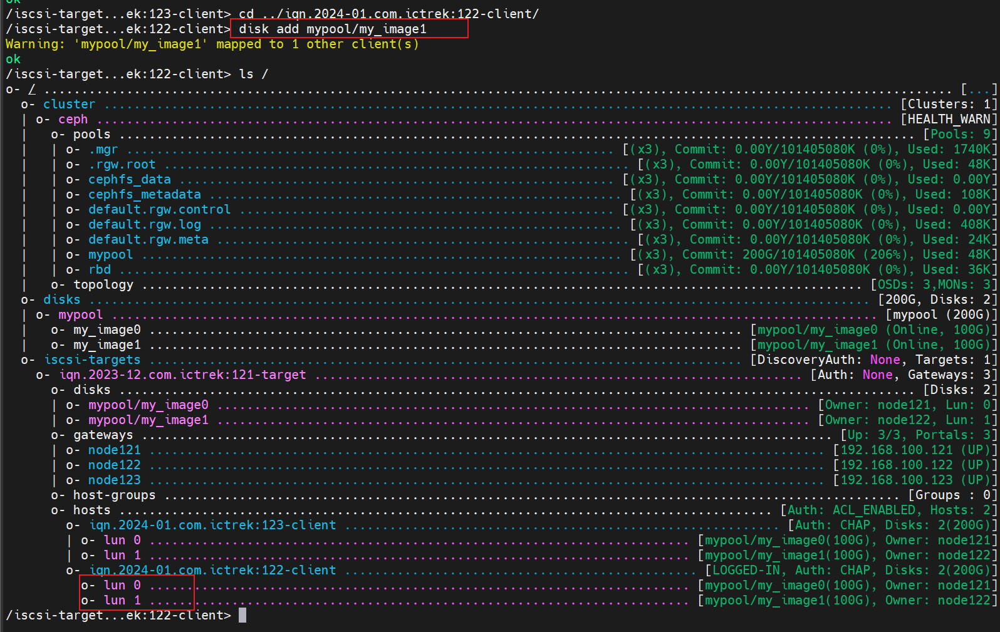
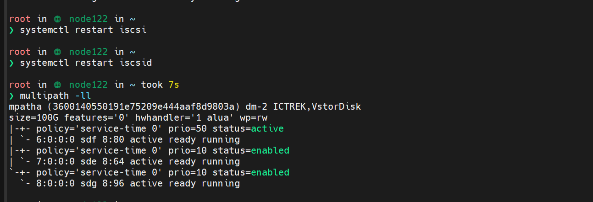
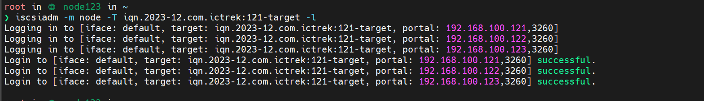
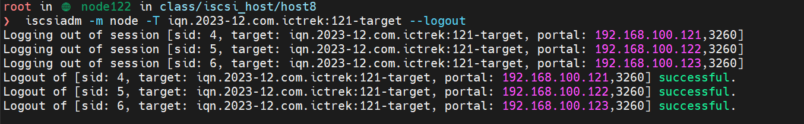
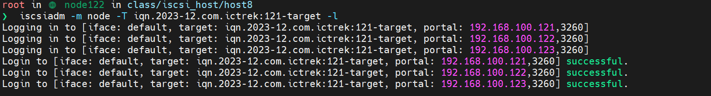
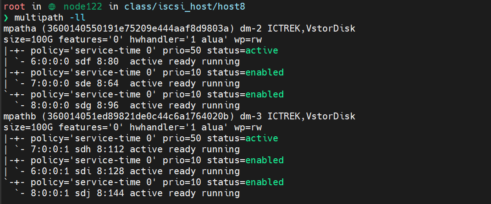

# 1. 问题

在 gwcli 中对 122-client 新增了一个 image，显示成功了，但是在 node122 中 multipath -ll 无法扫描到



只扫出原有的 map



# 2. 解决

已做操作：

- iscsiadm -m discovery -t st -p node121
- systemctl restart iscsi
- systemctl restart iscsid


排查：

1. `iscsiadm -m node -T iqn.2023-12.com.ictrek:121-target -l` 发现输出为空


正常的 node123：




2. 手动重启 iSCSI 服务后，退出 iscsi
   ```
   iscsiadm -m node -T iqn.2023-12.com.ictrek:121-target --logout
   ```

    


3. 重新关联
   ```
   iscsiadm -m node -T iqn.2023-12.com.ictrek:121-target -l
   ```

    


4. 再次检查 mpath
   ```
   multipath -ll
   ```

    
