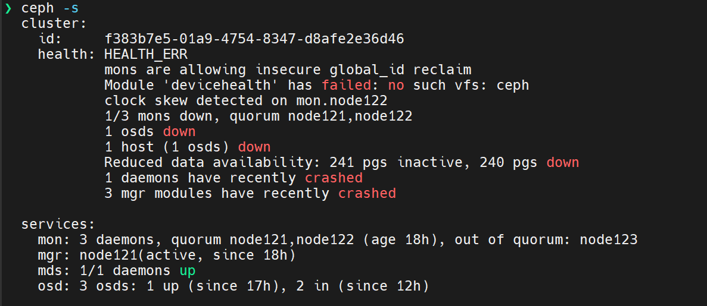

# 现象

1. 环境：
   - AlmaLinux release 8.8 (Sapphire Caracal)
2. 背景：
   - node121、122、123 都是 PVE 上的虚拟机，node121 配置了 multipath、iscsi-target
   - PVE 出现故障重启后，ceph 集群挂掉（当前版本的 VOS 没有实现自动拉起 ceph 服务），检查 ceph 状态发现 1 个 osd down，1 个 osd out

# 解决

1. `mon: 3 daemons, quorum node121,node122 (age 18h), out of quorum: node123` ：

   - 说明 node123 不在集群中，检查发现 node123 因为 boot order 原因启动失败，所以没有加入集群
   - 解决办法是修改 node123 的启动顺序，确保其正常启动
   - 手动拉起 node123 相关的 ceph 服务
2. `osd: 3 osds: 1 up (since 17h), 2 in (since 12h)`：

   - 用 `ceph osd tree` 检查 osd 状态
   - 检查对应 osd 所在节点的各项服务
     - ceph-mon.target
     - ceph-osd.target
     - ceph-mon@node122、121、123
